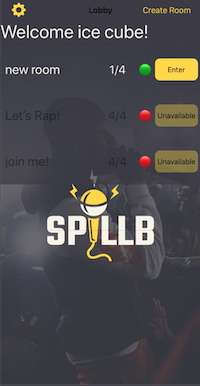

 
# SPILLB - Spill Your Bars

A platform where users can have a  session of freestyle rapping with other users.
Features:

1. Create users
2. Authenticate users with Firebase
3. Lobby page of listed in-session rooms created with UITableView
4. Users can create rooms with desired number of participants
5. Auto-updated lobby in realtime when rooms are created
6. Listed rooms in the Lobby page are displayed as either available or unavailable if the room is full or started a session
7. Room creator has the ability to start the session
8. When the room creator exits the room, the next participant can start the session
9. Animated circular timer to indicate how much time each rapper has to rap
10. Automatic mute participants who are not currently rapping, and unmute participant who has the next turn

## More about the project 

* Auto-layout and Storyboard UI with Swift
* MVC Architecture
* Backend using Cloud Firestore
* Register and authenticate users using FirebaseAuth
* Object Oriented Programming 
* VoxeetSDK used to create voice conference session. 
* VoxeetSDK is also used to mute and unmute user's device

For the presentation of the app in use, please see the following link 
https://youtu.be/vuVWUoh0cxM

